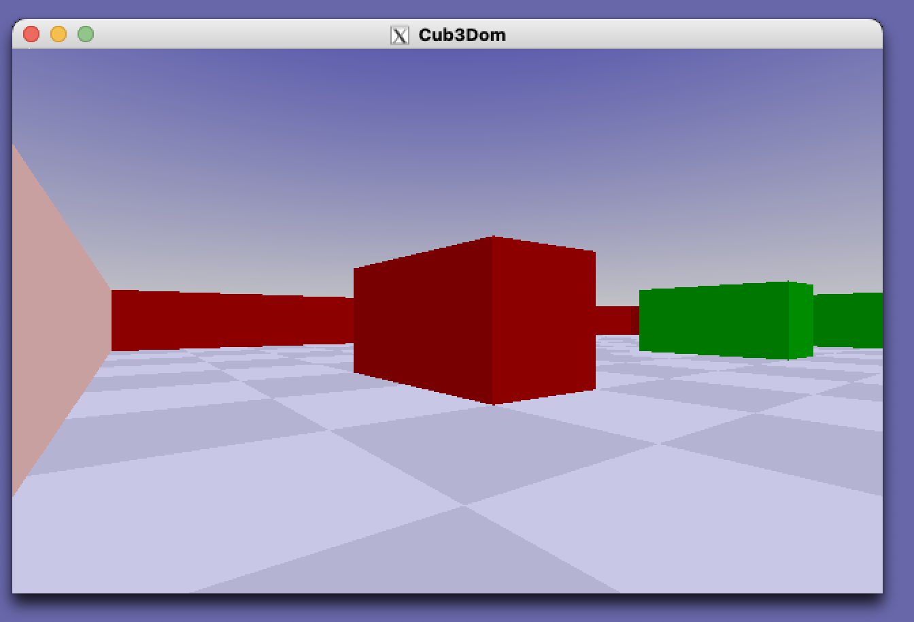

# Cub3Dom

Projet perso de rendu 3D en C, librement inspiré du projet **Cub3D** de l'école 42.

## Pourquoi ce projet ?

Se faire plaisir en recodant en C — après 25 ans ! — autour d'un sujet qui m'a toujours plu : un petit moteur de raycasting.

## Approche « objet » en C

Le code est écrit en C, mais organisé de façon proche de la programmation orientée objet :

- **Types d'éléments extensibles** — cubes, plans (sol, ciel), conteneurs, et à terme sphères, etc. Chaque type peut être ajouté sans remanier tout le moteur.
- **Cycle de vie explicite** — chaque objet expose des fonctions dédiées (`init`, `free`, …).
- **Méthodes surchargées par type** — dispatch centralisé sur des opérations communes comme `cast_ray`, `print`, la mise à jour de la bounding box, etc.

Le cœur du modèle est la structure `t_object` et son enum de types (`O_Container`, `O_Sky`, `O_Floor`, `O_Cubes`, …), avec une union pour les données spécifiques à chaque type.

## Raycasting, pas l'algorithme de Doom

Le projet Cub3D de 42 décrit souvent l'algorithme **simplifié** utilisé par Doom — ultra-rapide, mais limité aux murs verticaux sur une grille 2D.

Ici, c'est un vrai **raycasting 3D** : chaque rayon est lancé dans l'espace, les intersections sont calculées avec les objets du monde (bounding boxes, faces de cubes, plans…), et la couleur du pixel est déterminée à partir du hit le plus proche.

## Compilation

```bash
make
```

Prérequis : X11, MiniLibX (inclus dans le dépôt), libft (inclus).

## Lancement

```bash
./cub3D
```

Contrôles : **Z/Q/S/D** ou **W/A/S/D** pour se déplacer, **flèches** pour tourner la tête.

## Résultat

Bon, bien sûr, ça rappelle les années 80

